# allocat

NOTE: This needs an enterprise slack workspace to install.

Allocat is a resource manager I created for work. It's used as a simple
way to keep track of resources inside Slack itself.

At the time of writing, this app does not meet the criteria to appear
on the Slack app marketplace (Mainly that it dynamically creates triggers)
which is why I decided to post it here to see if anybody else finds it useful.

I am not a Javascript/typescript developer. This is my first project in it.
Don't judge it too harshly ;)

This app:

- Allows creation/managing of "resources" per channel - This is just a string
  so can be anything. It is used by me to keep track of test machines that
  people use. This string can be re-used on different channels but it is
  classed as a different resource so both can be borrowed independently
- Allows users to borrow a resource for a specified time.
  As a safety feature the resource isn't automatically freed. The
  borrowing user _has_ to say they are finished
- Sends reminders to the user to free the resource when their time is up
  (Or extend the time they want to borrow it for)
- It will send a reminder every 15 minutes (Between 8am and 8pm) if the
  user ignores the reminders.
- Allows notifications of when resources become free.
  If a user reacts with the emoji :eyes: to the "borrow" message
  they will be notified when it is free.

## Demo screenshots

Main flow:

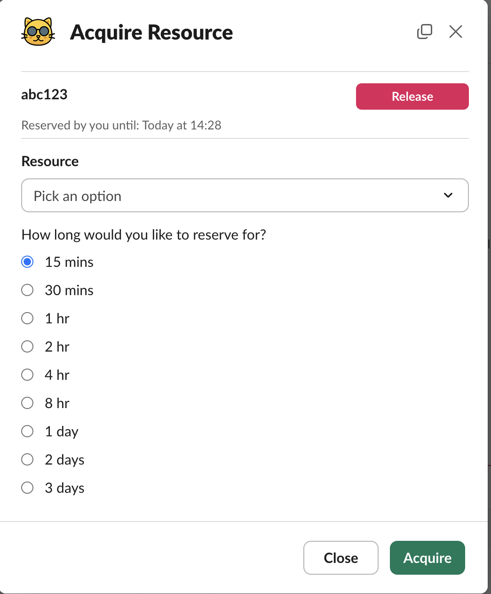
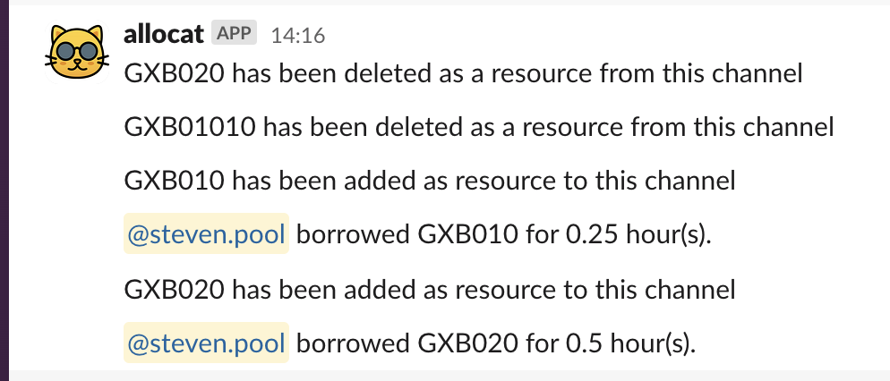
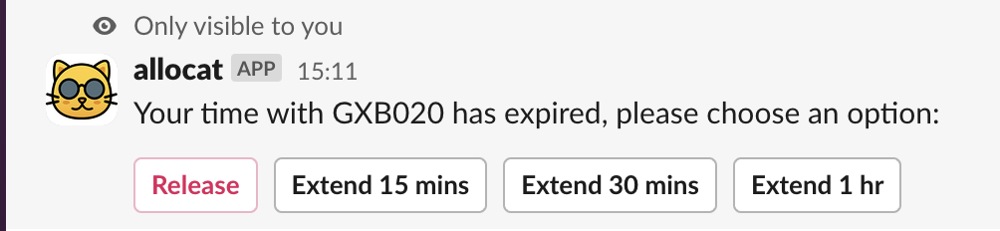

Managing of resources:

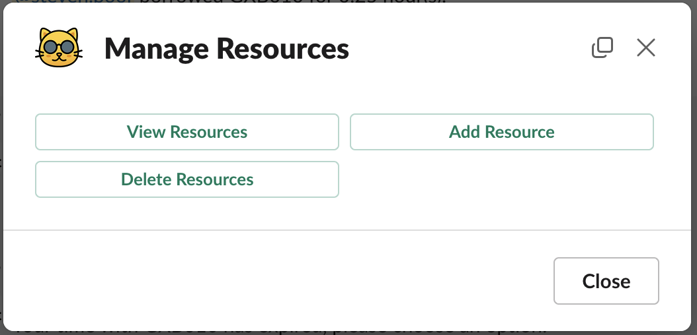
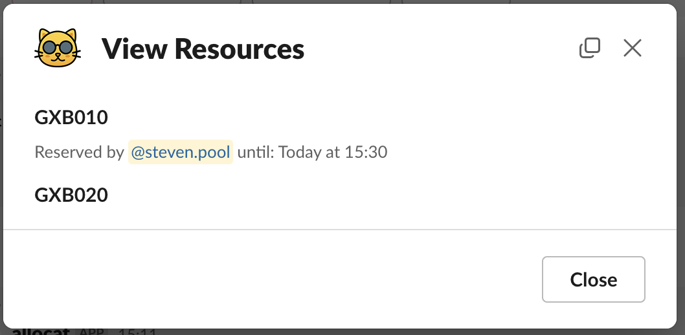
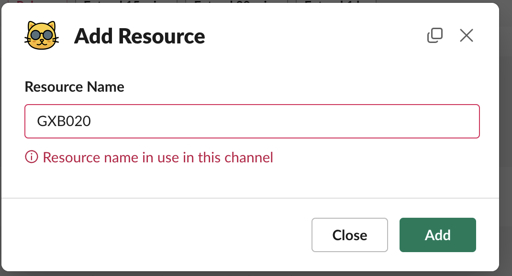
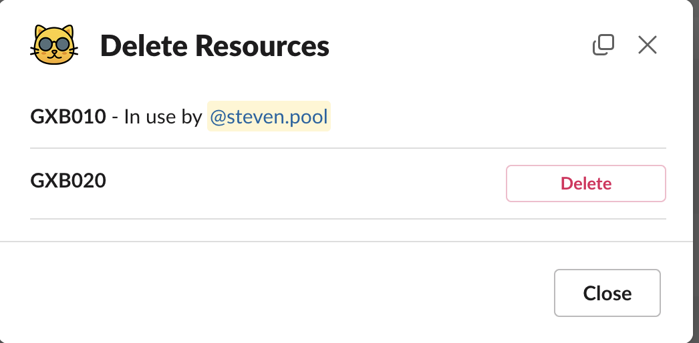

Watching of resources:

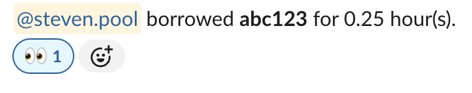
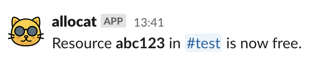

## Setup

Setup instructions:

1. Make sure you have installed the Slack CLI and then linked it up to whatever
   workspaces you want to deploy to:

[Quickstart Guide](https://api.slack.com/automation/quickstart) (Step 1 & 2)

2. Clone this repo and cd into the folder (`git clone git@github.com:ste-pool/allocat.git && cd allocat`)

3. Run `slack deploy`. If this is the first time deploying allocat it will
   ask you to `Install into a new workspace` or similar. If you need permissions
   to install apps into the workspace it will prompt here to request admin approval.
   Go ask whoever maintains your slack enterprise (probably IT) to approve. Then
   run `slack deploy` again and it should work. Once approved, you can keep deploying
   as long as you don't change the bot scopes in the manifest.ts - If you do, the next
   `slack deploy` you run will then need another admin approval.

4. It will ask you to select a trigger to create. Unfortunately you can't say "All".
   If you want an easy install, I'd select `Do not create a trigger` then run the command
   below once it has been deployed, to install all the (current) triggers.

```
slack trigger create --trigger-def triggers/acquire_resource_trigger.ts && \
slack trigger create --trigger-def triggers/manage_resource_trigger.ts && \
slack trigger create --trigger-def triggers/reactions_trigger.ts
```

4. It is now deployed! Yes! To use it, head to any channel and invite @allocat to any
   channel you wish to use it in. _Even public channels need allocat to be invited_

5. Slack may take a bit of time to refresh the commands/triggers that are there.
   If you head into one of the channels you've invited allocat to, and type `/manage` you
   should see "Manage resources [allocat]" or similar. If not, you need to manually
   view workflows to give Slack a kick. As of the time of writing you do this by clicking on
   the ...More button on the left side toolbar then select Automation then head to Workflows.
   Done. Head back to the channel and you should now be able to do `/manage`

### Usage

1. Invite allocat to a channel.

   - Send a message in the channel that says @allocat or invite from the top bar

2. Add resources to the channel.

   - `/manage` and click on Manage resources. then click `Add Resource`

3. Anyone that wants to borrow the resource can then run `/acquire` to acquire the
   resources for a time.

   - Alternatively, you can use the Workflows tab on top of the channel.
   - Alternate alternatively you can use a featured workflow (See customisations).

4. To release a resource, either wait for the reminder message or run `/acquire`
   again and you can see the devices you've currently borrowed in that channel.

5. If someone has a resource you have, react with :eyes: on the message that says
   "X has borrowed the resource" and allocat will send you a notification when it's free.

## Customisations

There are a few tweaks you can do to change the behaviour:

1. There is a prompt when using the workflows saying "Do you want to allow this workflow" or similar.
   That is because of the emoji:read manifest and the react workflow to watch for the :eyes: emoji.
   If you don't need that feature, you can tweak the manifest to remove the two lines commented and
   remove the react trigger (`slack trigger remove` and select the reaction trigger) and then
   redeploy (`slack deploy`)

   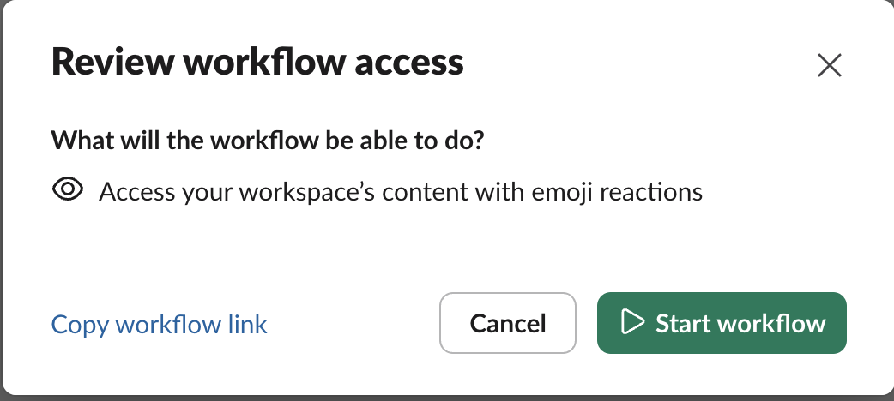

2. If the channel that allocat is on is only really to manage resources, you can tell slack
   to remove the normal text message box and just replace it with a button for Acquire resources.
   To do that, head to the channel and click on Workflows and add Acquire resource as a "feature workflow".

   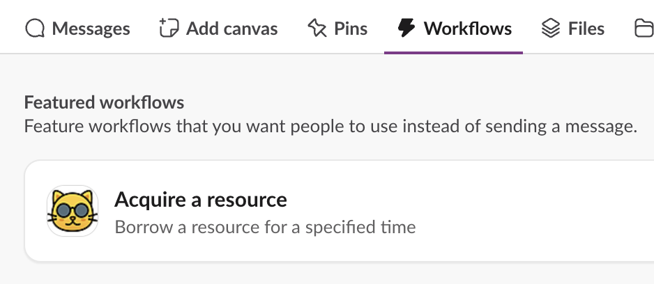
   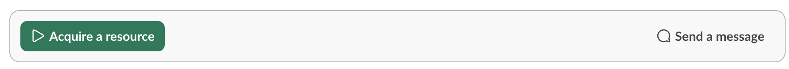

3. If you would like updates, or to change allocat yourself, I'd recommend enabling
   and using the manage workflow.

   Firstly create the release trigger:

   ```
   slack trigger create --trigger-def triggers/release_note_trigger.ts
   ```

   Then make a note of the trigger ID, and to make it only work for app collaborators
   (This means that only you can run this - You can read more [here](https://api.slack.com/automation/triggers/manage#manage))

   ```
   slack trigger access --trigger-id <The ID from the previous command. Should begin with Ft.> --grant --app-collaborators
   ```

   Then if you ever make some updates, add a new entry to versions.ts, and then you can run
   the workflow `/message` and find 'Message release note'. This will send the latest versions.ts entry
   to every channel that have some devices registered with allocat (To stop it posting in a channel,
   just make sure that all resources have been removed with /manage devices in that channel)

   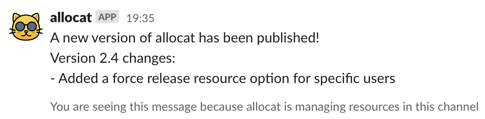

4. Sometimes, someone goes on holiday and forgets to release a resource. The policy of allocat
   is generally to let someone release the resource in case they have ongoing work. However,
   sometimes it is needed to force release a resource. For this, there is a workflow but I suggest
   limiting it to certain people to stop the abuse of the feature. Maybe channel admins or similar.
   This is a really similar process to 3. above:

   ```
   slack trigger create --trigger-def triggers/force_release_trigger.ts
   slack trigger access --trigger-id <The ID from the previous command. Should begin with Ft.> --grant --app-collaborators
   ```

   Then the app collaborators can run `/force release` in a channel to free up a resource

   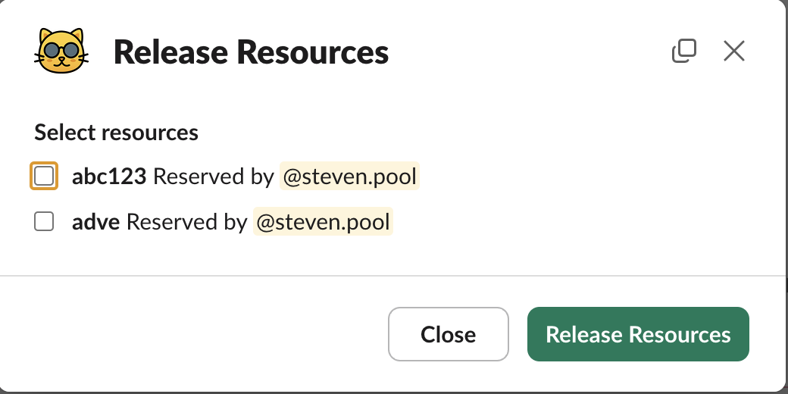

## Attribution

This project uses third-party resources. See [ATTRIBUTION.md](./ATTRIBUTION.md) for details.
